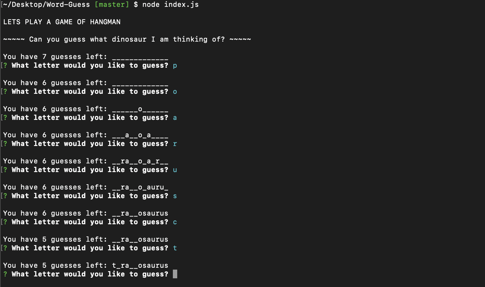

# Word-Guess

* This app is a CLI word guessing game. In order to run this app you will need to install node. In the terminal/cmd prompt run "node index.js" to start the app. Once the app begins the user will prompted a word (a type of dinosaur) to guess letters for, and a question: "What letter would you like to guess?" The word starts blanked out, but as the user guesses correctly the letters begin to fill in. Enough correct guesses reveal the word and the user wins. Guess wisely, the user has only 7 wrong attempts before they lose.

## Technologies used (Run "npm i" to install packages):
* Node.js 
* Inquirer.js

## Author: Gabriel Jacobs
